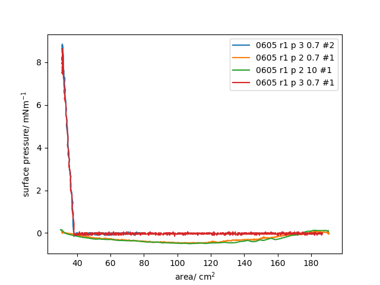

.. code-block:: python

    from pathlib import Path
    from specsnake.plotting import Plotter
    from specsnake.builtin_loaders import ExtractorFactory, provide_spectrum_constructor
    from specsnake.spectrum_factory import CustomSpectrumFactory, SpectrumFactoryProvider

    # Starting point: A directory filled with spectra of one type (Langmuir compression isotherms)
    # This must be a Path (from the pathlib library)
    base_dir = Path('/home/flo/PycharmProjects/specsnake/tests/data/test_lt')

    # To register a new type of spectra to the framework, we need an extractor to load the data from
    # the file, a constructor to instantiate the spectrum object and (optionally) a name transformer
    # to convert the file name to a string suitable to appear in a plot legend.

    # From the file we need two columns at the indices 2 and 4 with the names area surface pressure.
    # The file contains comments starting with '#' so we generate a suitable extractor.
    col_names = ("area",  "surface_pressure")
    extractor = ExtractorFactory(columns=(2, 4), column_names=col_names, comment='#').build()

    # The constructor is required to convert the data to an actual spectrum object. Using the generic BaseSpectrum
    # class, this is straightforward and requires only passing of the desired names for x and y unit strings.
    # The constructor must take the configuration for the units to label the plot axis and the name of the columns
    # to use as x and y values, they are passed as a config dictionary
    config = {'x_unit': 'area / cm$^2$', 'y_unit': 'surface pressure/ mNm$^{-1}$'}
    constructor = provide_spectrum_constructor('area', 'surface_pressure', **config)

    # we want to transform the name such that 'LT_0605_r1_p_2_0.7_#1.dat' -> '0605 r1 p 2 0.7 #1'
    name_transformer = lambda x: " ".join(x.stem.split('_')[1:])

    # now we can call create the CustomSpectrumFactory that is capable of converting all files to spectra
    factory = CustomSpectrumFactory(extractor, constructor, name_transformer)
    spectra = factory.build_batch(Path(base_dir))
    p = Plotter(spectra)
    p.show()

    # if kind of spectrum you want to plot

This procedure is much simpler if the desired type of spectrum is built in to the package.

.. code-block:: python

    factory = SpectrumFactoryProvider().provide_factory_by_name('lt')
    spectra = factory.build_batch(Path(base_dir))
    p = Plotter(spectra)
    p.show()

This code generates the same plot like the example above.